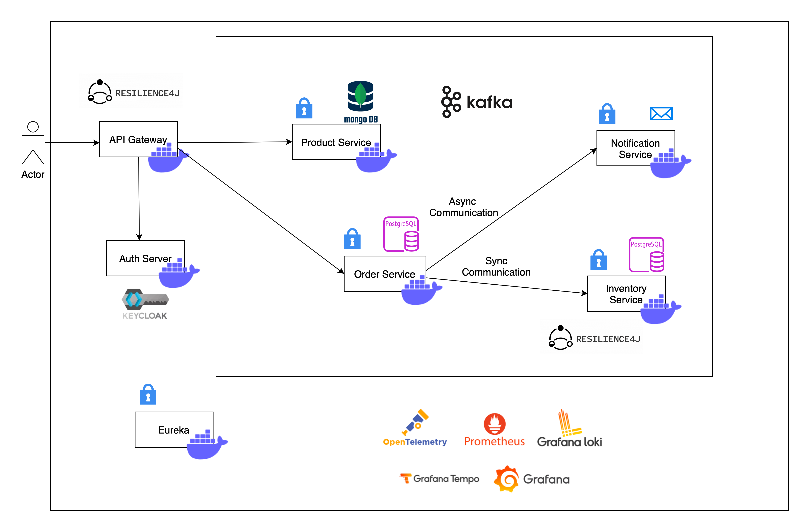

# E-Commerce Kubernetes Microservices Application

This project is a cloud-native, microservices-based e-commerce application designed for deployment on Kubernetes.
It demonstrates a distributed system design with resilience, observability, and secure communication between services.

## Architecture Diagram

## Overview

The system is composed of several independent microservices, each responsible for a specific business capability:

- **API Gateway**: Entry point for all client requests, handles routing, security, and resilience (Resilience4j).
- **Auth Server**: Handles authentication and authorization (Keycloak).
- **Product Service**: Manages product catalog, uses MongoDB for storage.
- **Order Service**: Handles order processing, uses PostgreSQL, communicates asynchronously (Kafka) and synchronously with other services.
- **Inventory Service**: Manages inventory stock, ensures consistency with orders.
- **Notification Service**: Sends notifications based on order events.
- **Eureka**: Service discovery for dynamic service registration.

## Communication
- **Synchronous**: RESTful HTTP between services (e.g., Order Service to Inventory Service).
- **Asynchronous**: Kafka for event-driven communication (e.g., Order Service to Notification Service).

## Observability & Monitoring
- **OpenTelemetry**: Distributed tracing.
- **Prometheus**: Metrics collection.
- **Grafana, Grafana Tempo, Grafana Loki**: Visualization, tracing, and logging.

## Resilience
- **Resilience4j**: Circuit breaker, rate limiter, and retry mechanisms for fault tolerance.

## Security
- **Keycloak**: OAuth2 and OpenID Connect for authentication and authorization.
- **Service-to-service security**: Enforced via API Gateway and internal policies.

## Deployment
- Designed for containerized deployment using Docker and orchestration with Kubernetes.
- Includes Docker Compose files for local development and testing.

## Getting Started
1. Clone the repository.
2. Build and run services using Docker Compose or deploy to Kubernetes.
3. Access the API Gateway to interact with the system.

For detailed setup and service-specific instructions, refer to the README files in each service directory.
